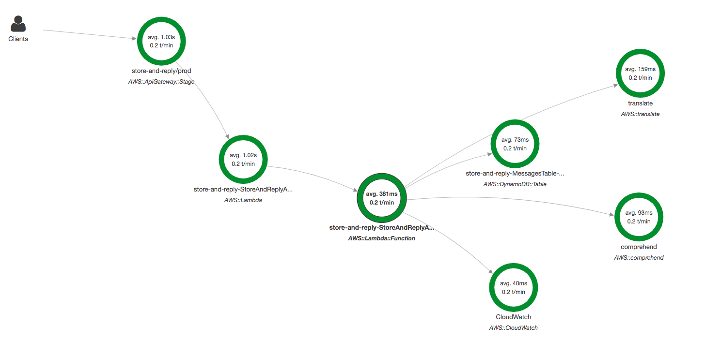

# AWS X-Ray Example



### Get Started with Yarn

`yarn install && yarn bundle`

### Deployment


```bash
sam build -t build/template.yaml
sam package --template-file build/template.yaml --output-template-file build/packaged.yaml --s3-bucket some-bucket-name
sam deploy --stack-name store-and-reply --capabilities CAPABILITY_IAM --region some-region
```
